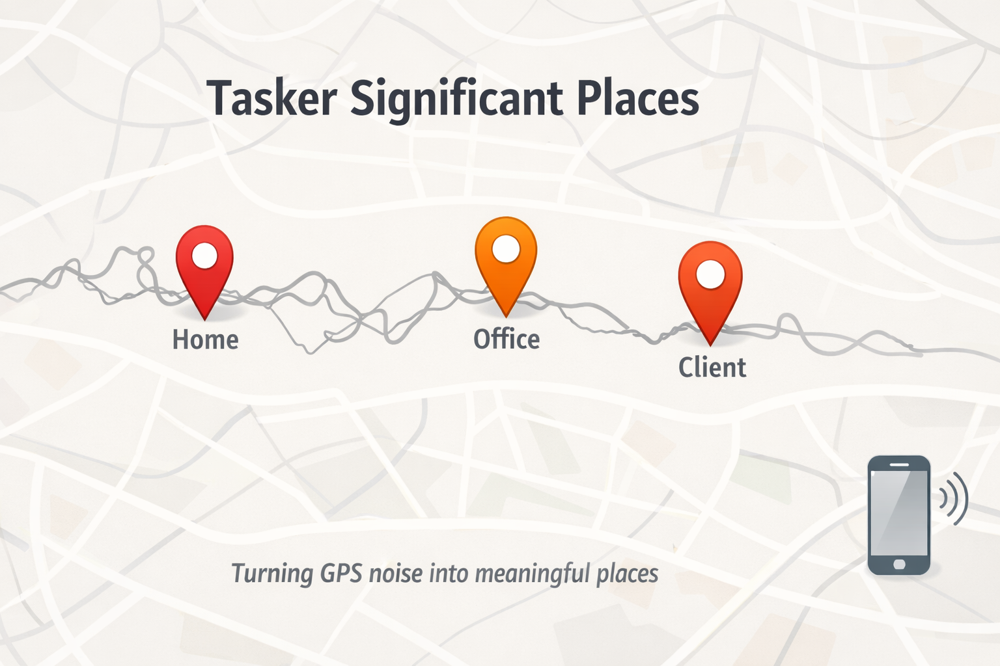

# tasker-significant-places



`tasker-significant-places` e' un progetto Tasker pensato per costruire un diario semplice dei luoghi in cui il telefono si e' fermato davvero durante la giornata.

L'idea nasce da un'esigenza pratica: non interessa registrare ogni singolo spostamento, ma capire con chiarezza **dove si e' stati** e **quando si e' arrivati in un luogo significativo**. In molte situazioni quotidiane un log di movimento continuo produce troppo rumore: semafori, traffico lento, soste brevi, pause tecniche. Questo progetto cerca invece di estrarre solo le soste che hanno davvero senso nel racconto della giornata.

Questo repository rappresenta l'evoluzione di prototipi precedenti, ma con un cambio importante di paradigma: non cerca piu' di descrivere il viaggio come sequenza di eventi di partenza, movimento e arrivo. Si concentra invece sui **luoghi significativi confermati**. Lo spostamento resta implicito tra due luoghi consecutivi.

## In parole semplici

L'automazione gira sul telefono, controlla periodicamente la posizione GPS e si comporta cosi':

1. identifica il luogo corrente noto
2. osserva se il telefono resta ancora in quell'area
3. se il telefono esce da quell'area, apre un candidato nuovo luogo
4. se il candidato resta stabile abbastanza a lungo, lo conferma
5. solo a quel punto scrive una riga nel CSV

Questo significa che il file finale non e' un tracciato di tutto il movimento, ma una lista pulita dei posti in cui il dispositivo si e' fermato in modo significativo.

## Schema a blocchi

```text
Campione GPS
    |
    v
Fix valido?
    | no -> ignora il campione
    | yes
    v
Dentro il luogo corrente?
    | yes -> resta nello stesso luogo, nessuna nuova riga
    | no
    v
Crea o aggiorna un candidato nuovo luogo
    |
    v
Il candidato resta stabile abbastanza a lungo?
    | no -> continua ad osservare
    | yes
    v
Conferma il nuovo luogo
    |
    v
Scrivi una riga nel CSV
```

## Cosa produce

Il risultato e' un CSV giornaliero con questo formato:

```text
TIMESTAMP;LAT;LON;PLACE_ID;NAME
2026-03-14 00.00;0.000000;0.000000;1;Luogo_1
```

Nel prototipo attuale il campo `TIMESTAMP` ha questo significato:

- per il primo record del giorno, rappresenta il momento in cui `INIT_SIGNIFICANT_PLACES` ottiene un fix valido
- per i luoghi successivi confermati, rappresenta il momento di nascita del candidato luogo, non il momento finale di conferma

Questo rende il log piu' vicino all'orario reale di arrivo, pur mantenendo la scrittura del record solo dopo che la sosta e' stata confermata.

## Parte tecnica

### Parametri attuali del prototipo

- `LOG_DIR=/storage/emulated/0/_SignificantPlaces`
- `PLACE_RADIUS_METERS=100`
- `MIN_STOP_MINUTES=5`
- `PLACE_NAME_PREFIX=Luogo_`
- `GPS_MAX_ACCURACY_METERS=50`

### Principi di base

- il primo luogo della giornata viene scritto subito come record iniziale
- un nuovo luogo viene confermato solo dopo una permanenza minima configurabile
- il CSV contiene solo luoghi confermati
- per i luoghi successivi al primo, il timestamp rappresenta la nascita del candidato confermato
- la documentazione e' in italiano
- XML, identificatori tecnici e codice restano in inglese

### Struttura della repo

- `config/tasker_globals.csv`
- `docs/visione_progetto.md`
- `docs/privacy_e_anonimizzazione.md`
- `docs/setup_telefono_android.md`
- `docs/convenzioni_linguistiche.md`
- `docs/precisione_dei_dati.md`
- `docs/strumenti_consigliati.md`
- `docs/specifica_logger_luoghi.md`
- `docs/mappa_variabili_tasker.md`
- `docs/configurazione_esterna.md`
- `docs/comportamento_operativo.md`

### Stato attuale

La repo contiene un prototipo Tasker funzionante con:

- `LOAD_CONFIG_DEFAULTS`
- `INIT_SIGNIFICANT_PLACES`
- `LOG_SIGNIFICANT_PLACE_SAMPLE`

Il prototipo attuale:

- legge realmente il file `tasker_globals.csv` sul telefono con fallback ai default interni
- scrive subito il primo luogo del giorno
- crea un candidato nuovo luogo quando il dispositivo esce dal raggio del luogo corrente
- conferma il candidato dopo il tempo minimo richiesto
- usa nel CSV il timestamp di nascita del candidato quando un nuovo luogo viene confermato
- scrive nel CSV solo i luoghi confermati
- gestisce una prima forma di recovery operativo su config minima mancante e cambio giorno

### Prossimi passi prioritari

- continuare i test reali in movimento con questa versione
- rifinire ulteriormente il comportamento operativo su riavvii e stati sporchi
- pulire le globali obsolete ancora presenti nell'ambiente Tasker
- introdurre successivamente riconoscimento di luoghi noti e report giornalieri